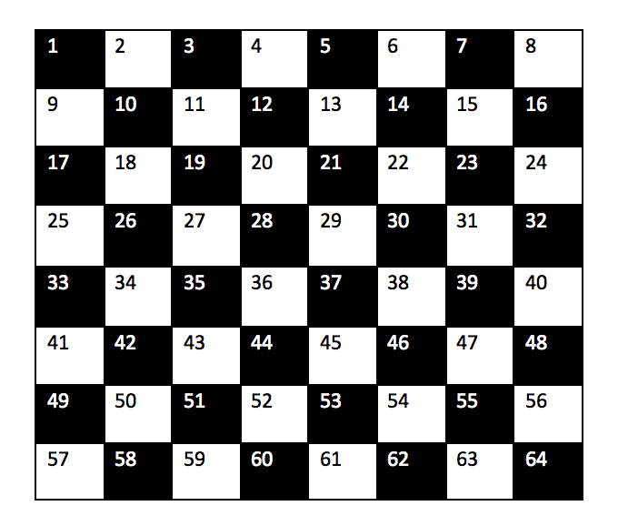

This repo contains my own solution of the bishop code kata

```
# Bishops
#
# Imagine you have a chessboard, it's a grid of size 8x8 represented by the numbers 1..64
#
#  1  2  3  4  5  6  7  8
#  9 10 11 12 13 14 15 16
# 17 18 19 20 21 22 23 24
# 25 26 27 28 29 30 31 32
# 33 34 35 36 37 38 39 40
# 41 42 43 44 45 46 47 48
# 49 50 51 52 53 54 55 56
# 57 58 59 60 61 62 63 64

# Write a method that accepts a starting position and an ending position of 
# a bishop on a chessboard and returns the number of moves it would take for
# the bishop to get there.
```

